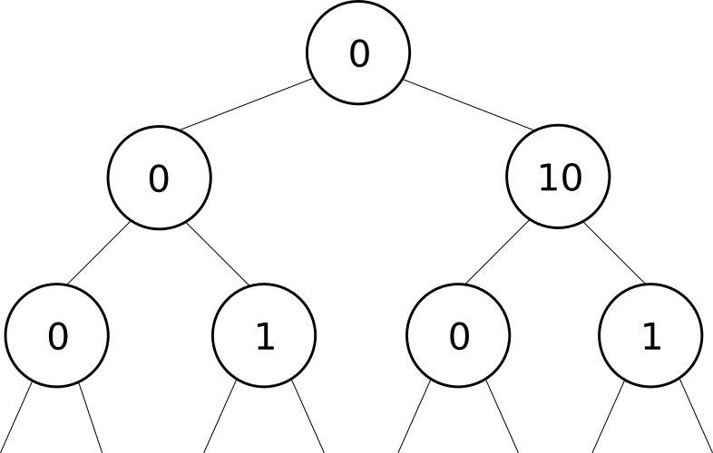

# 40. Combination Sum II
These are my three solutions for the "40. Combination Sum II" problem. I'll be using the array candidates=[10,1,2,7,6,1,5] and the target=8 to explain my approaches.

## Approach0: 
The recursive solution is online (generated by somebody else). The complexity of it isn’t any better than the following approaches (the recursive solution adds a lot of overhead, thus the iteration is always faster) and from the point of view of a beginner, I think that an iterative solution is easier to understand.


## Aproach1.java: 
### All the possible combinations.
Given the size n of an array of integers, we can infer that there are 2^n possible combinations to sum its elements. Our first approach will be a naive approach, where we'll be using all these combinations to find the right solutions. We need to find a methodology to let us know when to add a number or not, for example, a "0" would mean not to add it, while a "1" would mean to add it. That way, all the possible combinations will have this form:
0000000 0000001 0000010 ... 1111111
The combination 0110001 will add 1+2+5=8, and it will be one of our solutions. Those combinations resulting in a value different to the target will be ignored. For example, 0111001 will add 1+2+7+5=15 and it will be ignored.
Complexity Analysis
. Time complexity: O(n.2^n). Each element will be evaluated to verify if it will take part of the 2^n possible combinations.
. Space complexity: O(n.2^n) The extra space required depends on the number of combinations stored in the combination list, which stores exactly 2^n strings, each one having a size of n. 


## Aproach2.java: 
### All the possible combinations… but using a different methodology.

From the previous approach, we know we can use or not a number in a given sum. Is there a better data structure to solve this problem? Well, a binary tree could be a better solution. Let’s try it in the current approach.

According to the restrictions of the problem, we will be using just positive integers, so there won’t be any case in which a sum of a negative integer returns a result of 8 (e.g., -6+14=8). That way, the minimal number to start out the sum will be zero.

Given the first element, the dilemma is “Will we need it in all the possible solution?”.
We can represent that question with a tree node having two children. The left children will represent a ‘no’ and the right children will represent am ‘yes’. Besides, the node will record an element of the candidates array and then it will be possible to sum from the root to the leaves looking for a result equal to the target.

Our first node (the root) will hold the number 0. In its left side we could represent the absence of the first element of candidates and in its right side the presence of the first element of candidates. From the two nodes recently created we can follow the same logic to represent the second element of candidates, and so on and so on for the successive elements of candidates:

 

The function ‘findLeaves’ takes the root of the tree as a parameter and fill the static list ‘leaves’  with all the leaves of the mentioned tree. Given that it is a copy by reference (not by value), all the modification on the list will be affecting directly to the tree structure, so after we add the new children to these leaves (from the array ‘leaves’), they will be connected instantly to the tree.

Once the whole tree is created, we should find a way to sum the elements from the root to the leaves to find all the possible solutions. At this point, we have a function to find the leaves (‘findLeaves’), so after to create the whole tree, a nice approach would be to put all the leaves in an array and to get its sum all the way to the root. We can add a parent pointer in each Node structure and once all the elements from candidates are added to the tree, we can iterate from the leaves to the root to find all the valid solutions.

Complexity Analysis
. Time complexity: O(n.2^n). The final depth (or height) of the binary tree is n and we need to look for every leaf to find all the solutions.
. Space complexity: O(2^n) The extra space required depends on the number of nodes of the tree, which stores exactly 2^n leaves plus the inner nodes, representing a total of 2^(n+1) nodes. 


## Aproach3.java: 
### Keeping just the useful leaves.

From the previous solution, we are using the inner nodes just like a path to reach out the root node. What if we remove them, holding all the relevant information in the leaves? If we do that, then we can eliminate all the links from the Node structure (left, right and parent) and add to this structure a list of integers (‘path’) holding all the path to the root (from the point of view of the previous solution). This time, the member named ‘value’ will keep a partial sum of all the elements inside the list ‘path’. With this partial sum, we are able to eliminate those nodes with a sum greater than ‘target’.

The first thing to do is sorting the array of candidates. That way, we won’t analyze for elements of ‘candidates’ greater than ‘target’. Then, we can add the nodes in a set to avoid repetitions. We’ll get the following nodes, in the times t(i):

```
t1:
[{value=1, path={1}}]
t2:
[{value=2, path={1, 1}}, {value=1, path={1}}]
t3:
[{value=4, path={1, 1, 2}}, {value=2, path={1, 1}}, {value=3, path={1, 2}}, {value=1, path={1}}, {value=2, path={ 2}}
...
```

If the value of a node is equal to the target, then its path is added to the list of solutions (‘solutions’) and the node is discarded. The node is not created if its value would be greater than the target.

Complexity Analysis
. Time complexity: O(n*m). In average, we’ll get a better performance than in the previous solutions, because we are eliminating a lot of nodes (when they are bigger than the target or when they are a valid solution). m is the amount of leaves to analyze in a given time. 
In the worst scenario, m get closer to 2^n in the last iteration. For example, candidates=[1, 10, 57, 136, 399, 1000] and target=122000, and there’s no valid solution.
. Space complexity: O(m). The extra space required depends on the number of nodes on the list, which could hold 2^n nodes in the worst scenario.
